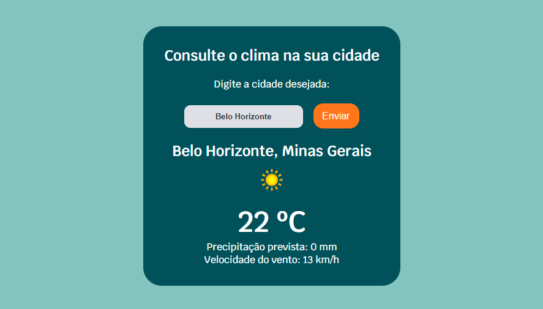

    

<h1 align="center">API Clima</h1>
Projeto de requisição de API de clima.

## ☔ **Sobre o projeto**
Desenvolvimento de um website de consulta climática, com a busca realizada a partir da cidade ou cidade e estado. A busca pode ser realizada a em português ou inglês, caso queira fazer a consulta em cidade fora do Brasil.

## 🎯 Objetivo

Colocar em prática os conhecimentos do módulo II de desenvolvimento frontend da **Resilia Educação**, colocando em prática todos as funcionalidades aprendidas até o momento, sobretudo o uso Jquery e Ajax para requisições de API.

##  🛠️ Tecnologias utilizadas

 
    
    
    
    

 

##  🛠️ Construído com

* [Visual Studio Code](https://code.visualstudio.com/)
* [Hoppscotch](https://hoppscotch.io/pt-br/)
* [Weather API](https://www.weatherapi.com/)
